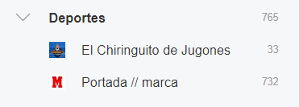

# Lectores de RSS

Jesús Pablo Barba Reyes

Luis Hidalgo Santaella

Visualiza los siguientes vídeos:
- [Qué es RSS](https://youtu.be/t5m5lKx6rEo)
- [Saber leer: RSS](https://youtu.be/kIgQatw7Qwg)

Date de alta en feedly.com y:
- Añade varias fuentes relacionadas con un tema original
    
    **El tema es deportes, cree una carpeta con todas las páginas web relacionadas que sigo en Feedly.**

  
- Añade a la categoría de noticias
  - Añade varias fuentes relacionadas con las noticias.
    
- Añade la fuente del europarlamento relacionada con la agricultura y pesca
  
  

  **Debemos de instalar el siguiente plugin en el navegador para poder suscribirnos a RSS que usen código XML**

- De cualquiera de las fuentes encontradas extrae los ficheros XML con formato rss o atom y súbelos al repositorio.
  - Fichero **[RSS](pruebarss.xml)**
  - Fichero **[ATOM](pruebaatom.xml)**
- Toma cada uno de los ficheros RSS y comprueba su validez 
  - Fichero rss válido
  
  
- Haz un listado de las etiquetas principales, debidamente organizadas
  - Fichero rss
        
      **Etiquetas principales en RSS:**
  - Channel, describe la fuente o canal RSS, contiene tres elementos obligatorios.
      + title: un título o elemento.
      + link: enlace o elemento.
      + description: descripción o elemento.
  +   Elementos opcionales:
      + category: define una o más categorías del canal.
      + copyright: información sobre derechos de autor.
      + language: idioma del canal.
      + lastBuildDate: fecha de la última modificación del contenido del canal.
      + pubDate: última fecha de publicación del canal.
      + skipDays, skipHours: Especifica los días/horas durante los cuales los agregadores deben omitir la actualización del canal. 
  - Item, los artículos contenidos dentro del canal RSS, tres elementos obligatorios.
      + title: un título o elemento.
      + link: enlace o elemento.
      + description: descripción o elemento.
  +   Elementos opcionales:
      + author: email del autor del artículo.
      + category: define categoría del artículo.
      + comments: enlace a los comentarios sobre un tema.
      + enclosure: Incluir archivos multimedia.
      + guid: id para el artículo.
      + source: especifíca fuente para artículo mediante un link.
     
  - Fichero atom
      
      **Etiquetas principales de ATOM:**
    - feed: Contiene información general sobre el feed, como el título, el autor, la fecha de publicación, etc.
    - entry: Contiene información sobre cada entrada o artículo individual en el feed.
    - title: Contiene el título de la entrada o del feed.
    - link: Contiene un enlace a la entrada o al feed.
    - updated: Contiene la fecha de la última actualización de la entrada o del feed.
    - author: Contiene información sobre el autor de la entrada.
    - id: Contiene un identificador único para la entrada.
    - content: Contiene el contenido de la entrada.
    - summary: Contiene un resumen de la entrada.
    - category: Contiene la categoría a la que pertenece la entrada.
---
---
---